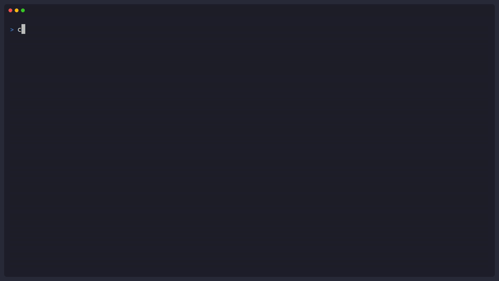
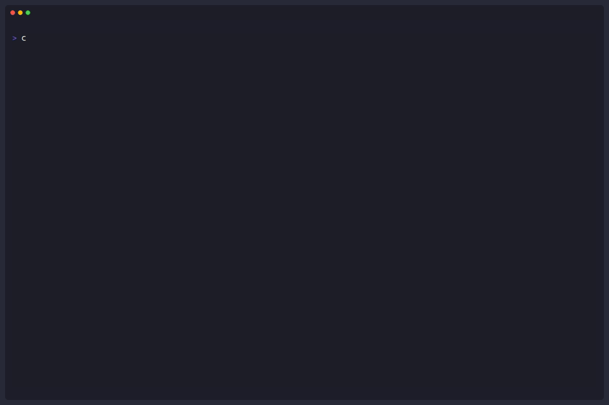
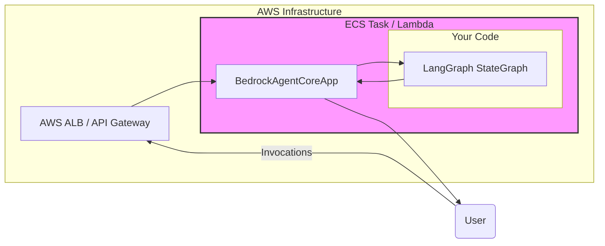
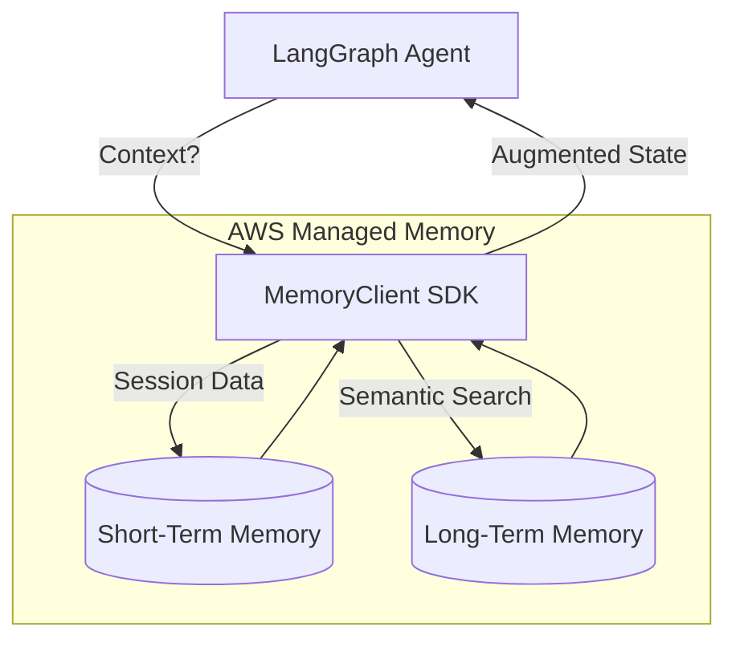

# AWS AgentCore + LangGraph

**Production-ready infrastructure for your LangGraph agents on AWS.**

This repository demonstrates how to bridge the flexible orchestration of **LangGraph** with the managed infrastructure of **AWS Bedrock AgentCore**. It provides the tooling to wrap, deploy, and manage stateful agents with persistent memory and secure tool access.

## Why use this?

Building a local agent demo is easy. Deploying it as a secure, scalable, and stateful service is hard. This project solves that by providing:

*   **Managed Runtime**: Wraps your `StateGraph` in a production-ready HTTP service (`BedrockAgentCoreApp`) that handles invocations and health checks.
*   **Persistent Memory**: Adds "Long-Term Memory" to your agents via `MemoryClient`, allowing them to remember user preferences and facts across different sessions.
*   **Tool Gateway**: Connects agents to external APIs and Lambda functions using the AgentCore Gateway (supports MCP).
*   **CLI Deployment**: A streamlined "Infrastructure-as-Code" workflow to `configure`, `launch`, and `manage` your agents on AWS.

## Prerequisites

*   Python 3.10+
*   AWS CLI (configured with `aws configure`)
*   Docker (running)

## Installation

Install the necessary packages:

```bash
pip install bedrock-agentcore bedrock-agentcore-starter-toolkit langgraph
```

## Quick Start

### 1. Create your Agent (`agent.py`)

Here is a minimal example that wraps a simple LangGraph agent:

```python
from langgraph.graph import StateGraph, START
from langgraph.graph.message import add_messages
from bedrock_agentcore.runtime import BedrockAgentCoreApp
from typing import Annotated
from typing_extensions import TypedDict

# 1. Define State
class State(TypedDict):
    messages: Annotated[list, add_messages]

# 2. Define Logic
def agent_node(state):
    return {"messages": [("assistant", f"Echo: {state['messages'][-1].content}")]}

# 3. Build Graph
builder = StateGraph(State)
builder.add_node("agent", agent_node)
builder.add_edge(START, "agent")
graph = builder.compile()

# 4. Wrap with AgentCore
app = BedrockAgentCoreApp()

@app.entrypoint
def invoke(payload, context):
    # Map AgentCore payload to LangGraph state
    user_input = payload.get("prompt", "")
    result = graph.invoke({"messages": [("user", user_input)]})
    return {"result": result["messages"][-1].content}

if __name__ == "__main__":
    app.run()
```

### 2. Configure & Launch

Use the `agentcore` CLI to deploy your agent to AWS.

```bash
# 1. Configure deployment (creates .bedrock_agentcore.yaml)
agentcore configure -e agent.py --name my_first_agent --region us-east-1

# 2. Deploy infrastructure (CloudFormation + CodeBuild)
agentcore launch

# 3. Test your agent
agentcore invoke '{"prompt": "Hello from CLI!"}'
```

### 3. Cleanup

To remove all created AWS resources:

```bash
agentcore destroy
```

## Project Structure

*   **`examples/`**: Complete, working implementations.
    *   `runtime-demo/`: Basic "Hello World" deployment.
    *   `memory-demo/`: Integrating Short-Term and Long-Term memory.
    *   `gateway-demo/`: Connecting to external tools via Gateway.
*   **`skills/`**: Reference documentation and guides (Primary Domain Reference).

## Demos & Visuals

### 1. Persistent Memory (STM + LTM)
Demonstrates the agent remembering user facts ("Polka Dot Socks") across different sessions using the managed Memory service.


### 2. Tool Gateway (MCP Unification)
Shows how multiple tools (Lambda, OpenAPI, MCP) are unified behind a single secure endpoint for LangGraph agents.



### 3. Full Lifecycle Management
Streamlined CLI workflow (`configure`, `launch`, `invoke`, `destroy`) to manage the entire infrastructure lifecycle of your agents.



## Architecture

### The Runtime Exoskeleton
`BedrockAgentCoreApp` acts as the production adapter for your `StateGraph`.



### Managed Memory Flow
`MemoryClient` handles both turn-by-turn history (STM) and cross-session facts (LTM).



## Documentation & References

Detailed guides are located in `skills/aws-agentcore-langgraph/reference/`:

| Topic | File | Description |
|-------|------|-------------|
| **Runtime** | [`agentcore-runtime.md`](skills/aws-agentcore-langgraph/reference/agentcore-runtime.md) | Hosting, streaming, and async patterns. |
| **Memory** | [`agentcore-memory.md`](skills/aws-agentcore-langgraph/reference/agentcore-memory.md) | Implementing STM (Session) and LTM (Fact) memory. |
| **Gateway** | [`agentcore-gateway.md`](skills/aws-agentcore-langgraph/reference/agentcore-gateway.md) | Connecting Lambda, OpenAPI, and MCP tools. |
| **CLI** | [`agentcore-cli.md`](skills/aws-agentcore-langgraph/reference/agentcore-cli.md) | Command reference for deployment management. |

## Troubleshooting

| Issue | Solution |
|-------|----------|
| `Invalid agent name` | Use underscores, not hyphens (e.g., `my_agent`, not `my-agent`). |
| Cold start slow | First invocation might take time. Use `agentcore launch --local` for faster dev cycles. |
| Container not reading `.env` | Environment variables must be set in the `Dockerfile` or passed via `agentcore configure`, not a local `.env` file during runtime. |
| "Memory disabled" logs | Ensure you passed `--memory` (or selected it) during `agentcore configure`. |

---
*Unofficial integration for AWS Bedrock AgentCore.*