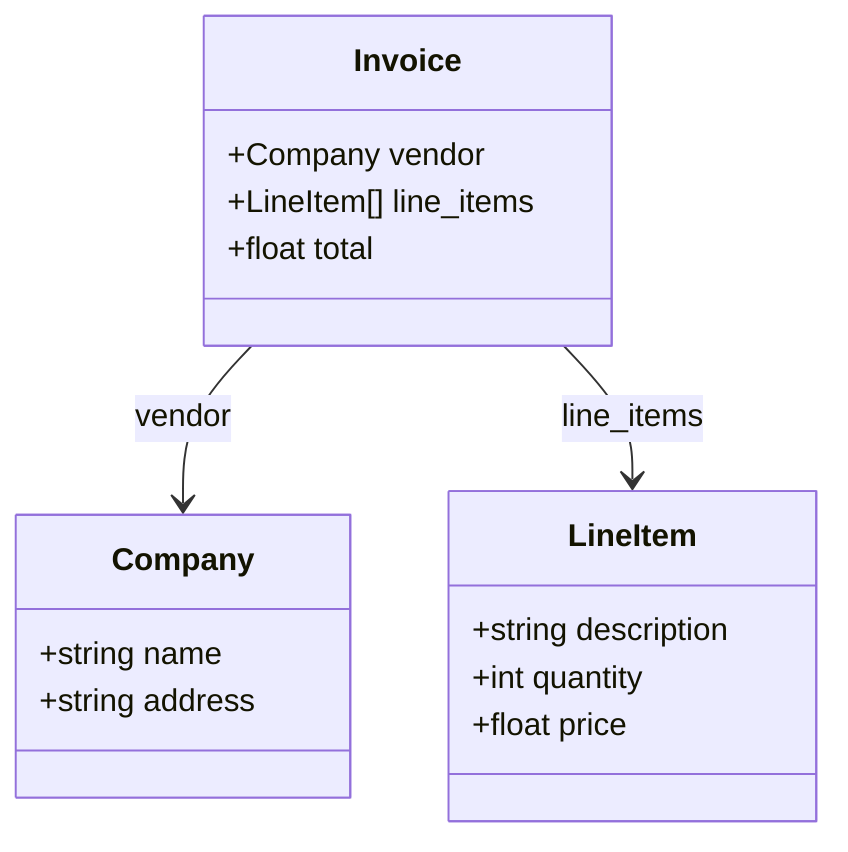

# Visualize/Design BAML Schema

Create or visualize BAML schemas with mermaid diagrams.

## Modes

### Visualize Existing Schema

If `$ARGUMENTS` is a file path or function name:
1. Read the schema
2. Generate mermaid class diagram
3. Show relationships between types

### Design New Schema

If `$ARGUMENTS` describes a data extraction task:
1. Analyze requirements
2. Design appropriate BAML types
3. Create mermaid visualization
4. Generate complete BAML code

## Visualization Output

For a schema like:
```baml
class Invoice {
  vendor Company
  line_items LineItem[]
  total float
}

class Company {
  name string
  address string
}

class LineItem {
  description string
  quantity int
  price float
}
```

Generate:


## Design Mode

If `$ARGUMENTS` describes a task like "extract meeting notes":

1. **Ask clarifying questions** (if needed):
   - What fields are required?
   - Are there optional fields?
   - Any validation rules?

2. **Generate schema**:
```baml
class ActionItem {
  assignee string
  task string
  due_date string?
}

class MeetingNotes {
  title string
  date string
  attendees string[]
  action_items ActionItem[]
}
```

3. **Generate function**:
```baml
function ExtractMeetingNotes(transcript: string) -> MeetingNotes {
  client GPT4
  prompt #"
    Extract meeting notes:
    {{ transcript }}
    {{ ctx.output_format }}
  "#
}
```

4. **Generate test**:
```baml
test MeetingTest {
  functions [ExtractMeetingNotes]
  args {
    transcript "Meeting on Jan 15..."
  }
}
```

## Arguments

`$ARGUMENTS` can be:
- File path: `/baml-schema baml_src/invoice.baml`
- Function name: `/baml-schema ExtractInvoice`
- Task description: `/baml-schema extract receipt data from images`
- Empty: Visualize all schemas in project

## Output

1. **Mermaid diagram** - Visual representation
2. **BAML code** - If designing new schema
3. **Relationships** - List of type dependencies
4. **Suggestions** - Improvements or validations to add

## Tips

- Use for complex schemas with 4+ related types
- Include union types in diagrams
- Show enum values when relevant
- Highlight validation (@assert/@check) in descriptions
